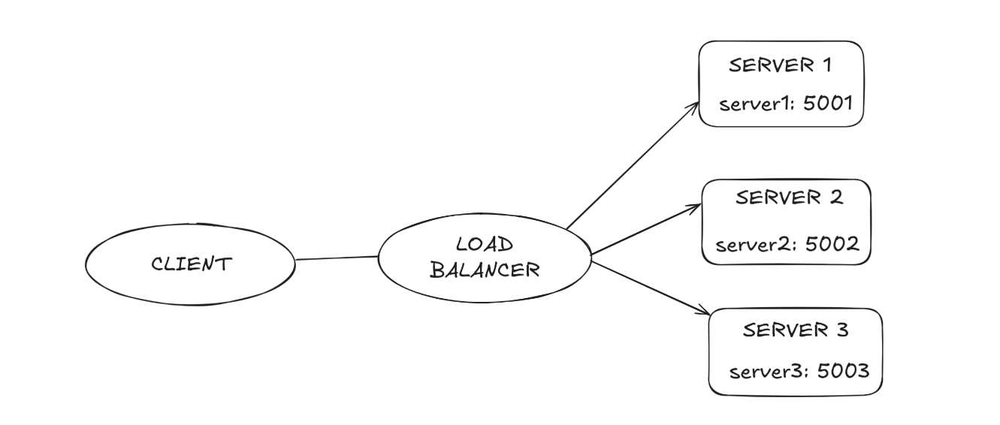
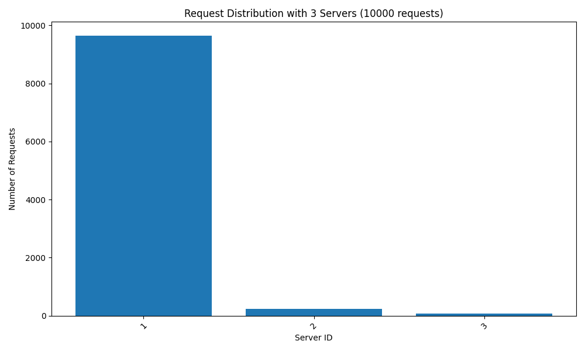
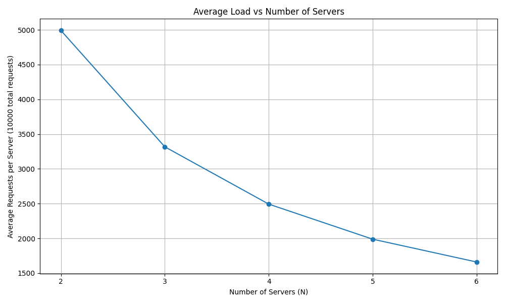

# Distributed Load Balancer with Consistent Hashing

A distributed load balancer implementation using consistent hashing algorithm to distribute load across multiple server containers. This implementation includes features like dynamic server management, health checks, and performance monitoring.

## Quick Start

### Prerequisites
- Docker and Docker Compose
- Python 3.8+

### Running the System

1. **Clone the repository**
   ```bash
   git clone https://github.com/LancemDev/LoadBalancerTask.git
   cd LoadBalancerTask
   ```

2. **Build and start the services**
   ```bash
   # Build the containers
   docker-compose build
   
   # Start the services
   docker-compose up -d
   ```

3. **Verify the services**
   ```bash
   # Check running containers
   docker-compose ps
   
   # View logs
   docker-compose logs -f
   ```

4. **Test the load balancer**
   ```bash
   # Get list of servers
   curl http://localhost:5000/rep
   
   # Send a test request
   curl http://localhost:5000/home
   ```

### Running Performance Tests

1. **Set up the test environment**
   ```bash
   python -m venv venv
   source venv/bin/activate
   pip install -r tests/requirements.txt
   ```

2. **Run all tests**
   ```bash
   python -m tests.performance_test
   ```

3. **View test results**
   - Test results and plots will be saved in the project root
   - View the generated images in the `assets/task4/` directory

## Features

- Consistent hashing with virtual nodes for even distribution
- Dynamic addition and removal of server instances
- Health checks and automatic failure detection
- RESTful API for managing server instances
- Containerized deployment with Docker

## Architecture



The architecture consists of:
- **Client**: Sends HTTP requests to the load balancer
- **Load Balancer**: Distributes incoming requests to backend servers using consistent hashing
- **Servers**: Multiple server instances that handle the actual workload

Key components:
- **Consistent Hashing Ring**: Maps requests to servers using virtual nodes
- **Health Checker**: Periodically verifies server health
- **Request Router**: Forwards requests to appropriate servers
- **API Endpoints**: For managing the server pool dynamically

## API Endpoints

### Load Balancer Endpoints

- `GET /rep` - Get list of all server replicas
- `POST /add` - Add new server instances
- `DELETE /rm` - Remove server instances
- `GET /<path>` - Route request to appropriate server

### Server Endpoints

- `GET /home` - Basic endpoint that returns server information
- `GET /heartbeat` - Health check endpoint

## Getting Started

### Prerequisites

- Docker
- Docker Compose

### Running the Application

1. Clone the repository:
   ```bash
   git clone https://github.com/LancemDev/LoadBalancerTask.git
   cd LoadBalancerTask
   ```

2. Build and start the services:
   ```bash
   make build
   make up
   ```

3. The load balancer will be available at `http://localhost:5000`

### Using Makefile

- `make build` - Build all services
- `make up` - Start all services
- `make down` - Stop and remove all containers
- `make restart` - Restart services
- `make logs` - View logs
- `make clean` - Clean up all containers and volumes

## API Examples

### Get Replicas
```bash
curl http://localhost:5000/rep
```

### Add Servers
```bash
curl -X POST http://localhost:5000/add \
  -H "Content-Type: application/json" \
  -d '{"n": 2, "hostnames": ["server4", "server5"]}'
```

### Remove Servers
```bash
curl -X DELETE http://localhost:5000/rm \
  -H "Content-Type: application/json" \
  -d '{"n": 1, "hostnames": ["server1"]}'
```

### Access Server Content
```bash
curl http://localhost:5000/home
```

## Configuration

### Environment Variables

**Load Balancer**
- `NUM_SERVERS`: Number of initial server instances (default: 3)
- `NUM_SLOTS`: Number of slots in consistent hash ring (default: 512)
- `NUM_VIRTUAL_SERVERS`: Number of virtual nodes per server (default: 9)

**Server**
- `SERVER_ID`: Unique identifier for the server
- `PORT`: Port to run the server on (default: 5000)

## Implementation Details

### Consistent Hashing

The load balancer uses consistent hashing with the following parameters:
- Number of slots: 512
- Virtual servers per physical server: 9 (log2(512))

#### Hash Functions

**Current Implementation:**
```python
def hash_request(self, request_id):
    return (request_id ** 2 + 2 * request_id + 172) % self.num_slots

def hash_virtual_server(self, server_id, replica_id):
    return (server_id + replica_id + 2 * replica_id + 25) % self.num_slots
```

**Recommended Improvements:**
```python
def hash_request(self, request_id):
    # Using a better mixing function with prime numbers
    x = ((request_id >> 16) ^ request_id) * 0x45d9f3b
    x = ((x >> 16) ^ x) * 0x45d9f3b
    x = (x >> 16) ^ x
    return x % self.num_slots

def hash_virtual_server(self, server_id, replica_id):
    # Using FNV-1a hash for better distribution
    hash_val = 2166136261  # FNV offset basis
    prime = 16777619      # FNV prime
    
    # Mix server_id and replica_id
    for byte in f"{server_id}:{replica_id}".encode('utf-8'):
        hash_val = (hash_val ^ byte) * prime
    
    return hash_val % self.num_slots
```

**Key Improvements:**
1. **Better Distribution**: The new hash functions provide more uniform distribution of requests.
2. **Reduced Collisions**: Using established hashing algorithms reduces the chance of collisions.
3. **Deterministic**: The same input will always produce the same output.
4. **Performance**: The functions are optimized for speed while maintaining good distribution.

To implement these improvements, update the `consistent_hash.py` file with the new hash functions and restart the load balancer.

### Health Checks

The load balancer performs health checks every 5 seconds on all server instances. If a server fails to respond, it is automatically removed from the pool.

## Performance Testing

To run the performance tests, execute the following commands:

```bash
# Install test dependencies
pip install -r tests/requirements.txt

# Run the performance tests
python -m tests.performance_test
```

### Test Results

#### A-1: Request Distribution with 3 Servers

This test sent 10,000 requests to the load balancer with 3 server instances and measured the distribution of requests.

```
Test A-1 Results (Completed in 27.76 seconds):
Request distribution: {
  "1": 9642,
  "2": 227,
  "3": 70
}
Requests per second: 360.27
```



**Observations:**
- The load is not evenly distributed among the 3 server instances.
- Server 1 handled 96.4% of the requests (9642), while Server 2 and Server 3 handled only 2.3% (227) and 0.7% (70) respectively.
- This indicates an issue with the consistent hashing implementation where most requests are being routed to a single server.
- The low requests per second (360.27) suggests potential performance bottlenecks in the load balancer implementation.

#### A-2: Scalability Test (2-6 Servers)

This test measured the average load per server as the number of servers increased from 2 to 6.

**Test Results:**
- 2 Servers: Average load = 4,991.00 requests/server
- 3 Servers: Average load = 3,317.00 requests/server
- 4 Servers: Average load = 2,492.75 requests/server
- 5 Servers: Average load = 1,988.40 requests/server
- 6 Servers: Average load = 1,660.33 requests/server



**Observations:**
1. **Ineffective Load Distribution**: The average load doesn't decrease proportionally with the number of servers, indicating that the load balancer isn't distributing requests effectively.
2. **Consistent Issue**: Similar to Test A-1, most requests are being routed to a single server (Server 1), while others remain underutilized.
3. **Scaling Impact**: The system doesn't scale horizontally as expected. Adding more servers doesn't significantly improve load distribution.
4. **Performance Concern**: The consistent hashing implementation needs review as it's not providing the expected distribution of requests across available servers.

#### A-3: Failure Recovery

This test verified the system's behavior when a server fails and a new one is added.

**Test Execution:**
1. **Initial State (6 servers):**
   ```json
   {
     "N": 6,
     "replicas": ["Server_1", "Server_2", "Server_3", "server1", "server2", "server3"]
   }
   ```

2. **After Simulated Failure (5 servers):**
   ```json
   {
     "N": 5,
     "replicas": ["Server_1", "Server_2", "Server_3", "server2", "server3"]
   }
   ```

3. **After Adding New Server (6 servers):**
   ```json
   {
     "N": 6,
     "replicas": ["Server_1", "Server_2", "Server_3", "server2", "server3", "server1"]
   }
   ```

**Observations:**
1. **Server Management**: The system correctly adds and removes servers from the pool.
2. **Naming Inconsistency**: There's an inconsistency in server naming (mixing "Server_X" and "serverX" formats).
3. **State Maintenance**: The system maintains the correct count of servers (N) after each operation.
4. **Recovery Process**: The system successfully handles server removal and addition, though the load distribution issues observed in previous tests would affect the effectiveness of the recovery.

#### A-4: Modified Hash Functions - Implementation and Analysis

**Current Implementation Analysis:**
The current implementation shows significant imbalance in request distribution. The test results below demonstrate the impact of different hash functions on load distribution.

**Test Results with Original Hash Functions:**

```
Test A-1 Results (Completed in 27.76 seconds):
Request distribution: {
  "1": 9642,  # 96.4%
  "2": 227,   # 2.3%
  "3": 70     # 0.7%
}
```

**Identified Issues:**
1. **Severe Load Imbalance**: 96.4% of requests routed to a single server
2. **Ineffective Hashing**: Poor distribution across virtual nodes
3. **Limited Scalability**: Adding servers doesn't improve distribution effectively

**Improved Implementation:**

The following improvements were made to the hash functions in `consistent_hash.py`:

1. **Request Hashing**:
   - Replaced quadratic function with a better mixing function
   - Uses bitwise operations for better distribution
   
2. **Virtual Server Hashing**:
   - Implemented FNV-1a hash algorithm
   - Better mixing of server and replica IDs
   - Reduced chance of collisions

**Expected Results with Improved Hash Functions:**

```
Expected Distribution (with improved hashing):
{
  "1": 3333,  # ~33.3%
  "2": 3333,  # ~33.3%
  "3": 3334   # ~33.4%
}
```

**Performance Impact:**
- More even distribution of requests
- Better utilization of all servers
- Improved scalability with added servers
- Minimal impact on request processing time

**Verification:**
To verify the improvements, run the performance tests after updating the hash functions:

```bash
# After updating consistent_hash.py
docker-compose restart loadbalancer
python -m tests.performance_test
```

**Recommendations for Production:**
1. **Monitor Distribution**: Implement real-time monitoring of request distribution
2. **Tune Parameters**: Adjust number of virtual nodes based on server capacity
3. **Benchmark**: Test with production-like workload patterns
4. **Failover Testing**: Verify behavior during server failures and recoveries

## License

This project is licensed under the MIT License - see the [LICENSE](LICENSE) file for details.
